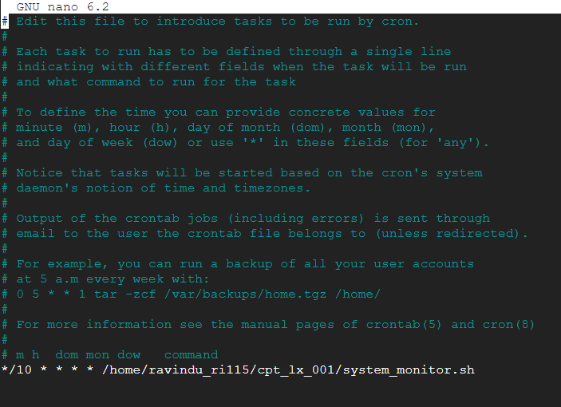

# System Monitor Script

## Description

This script logs system resource usage (CPU, memory, and disk) to a file with a timestamp. It can be run manually or set up as a cron job for periodic execution.

## Usage

### 1. Make the Script Executable

```bash
chmod +x system_monitor.sh

#Add a Cron Job
